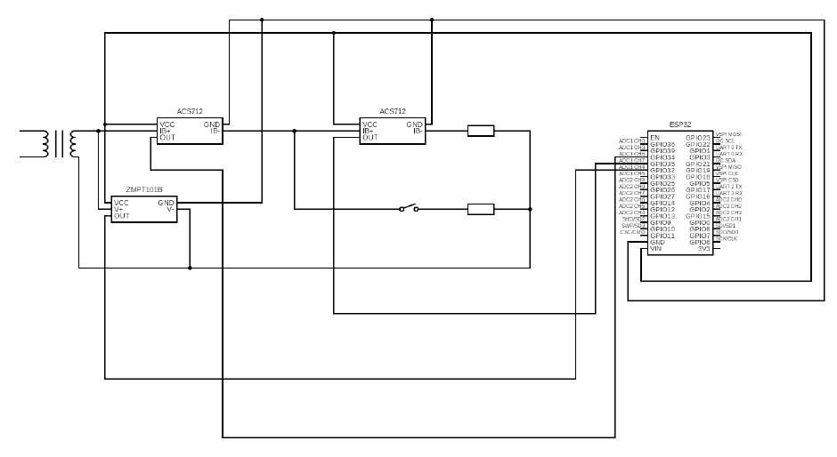
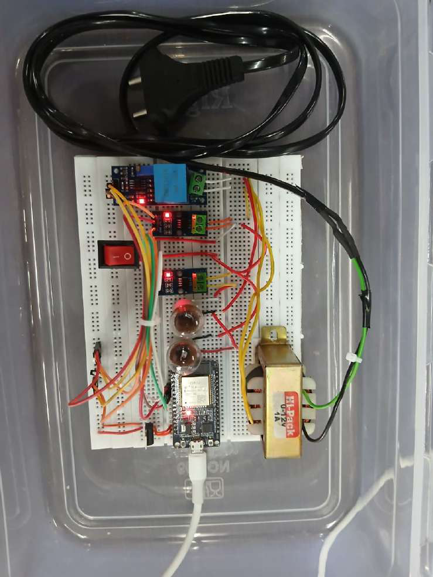
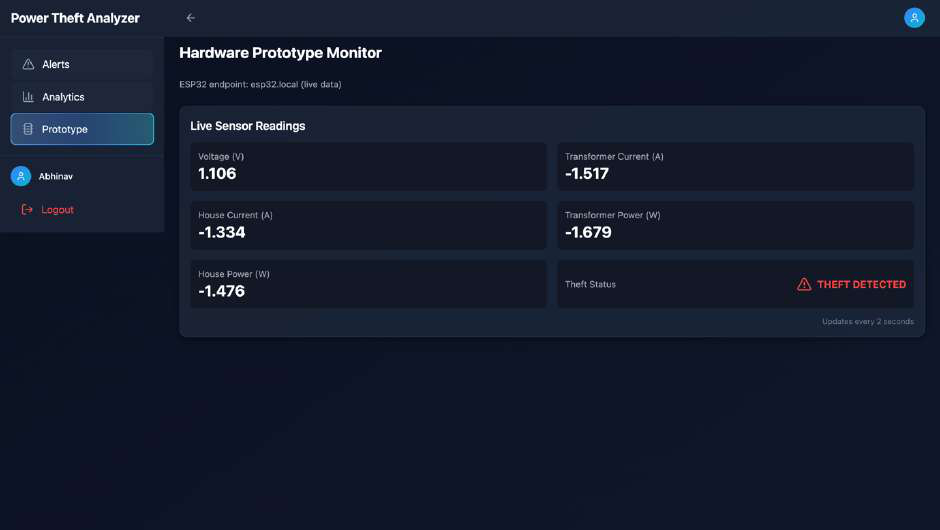
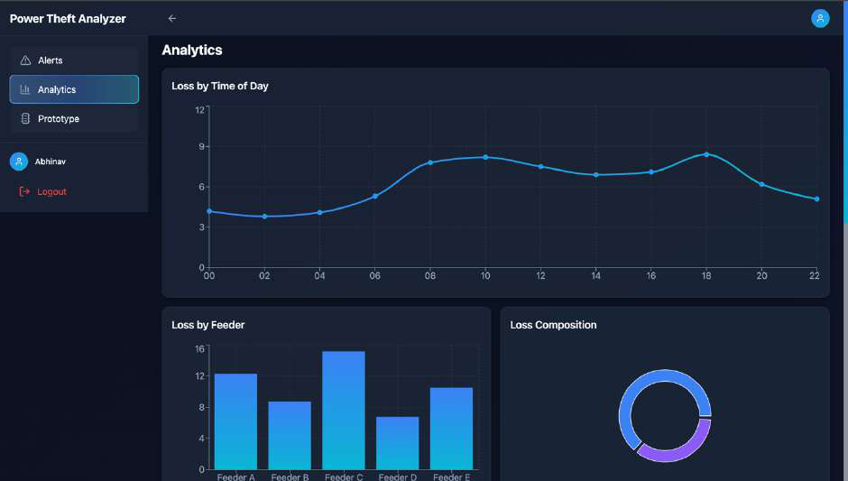
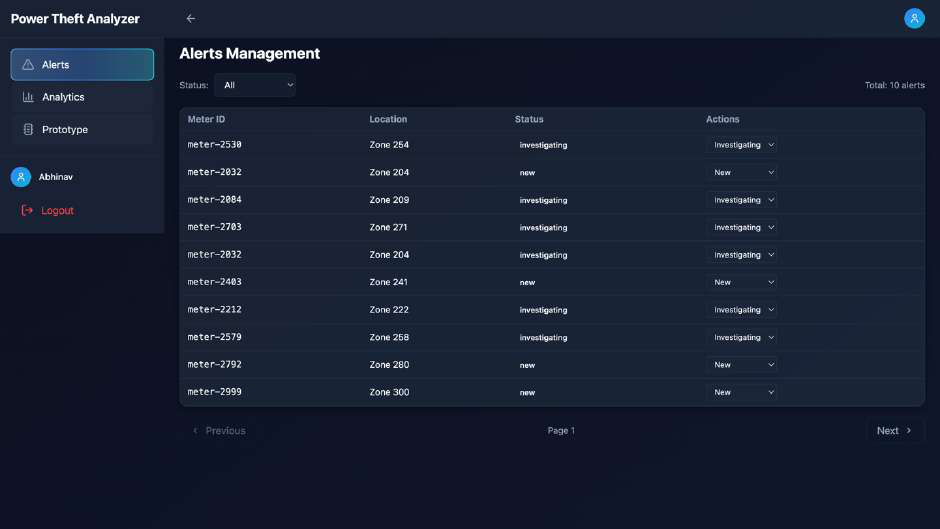
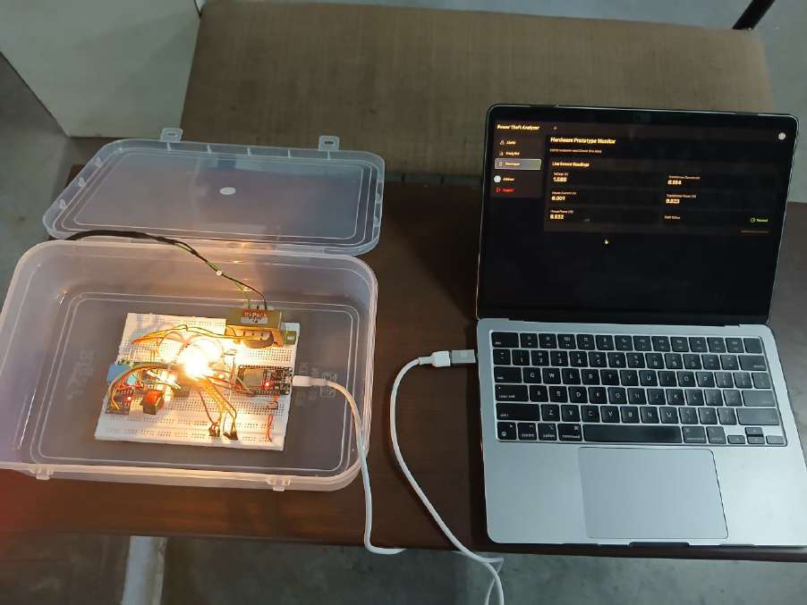
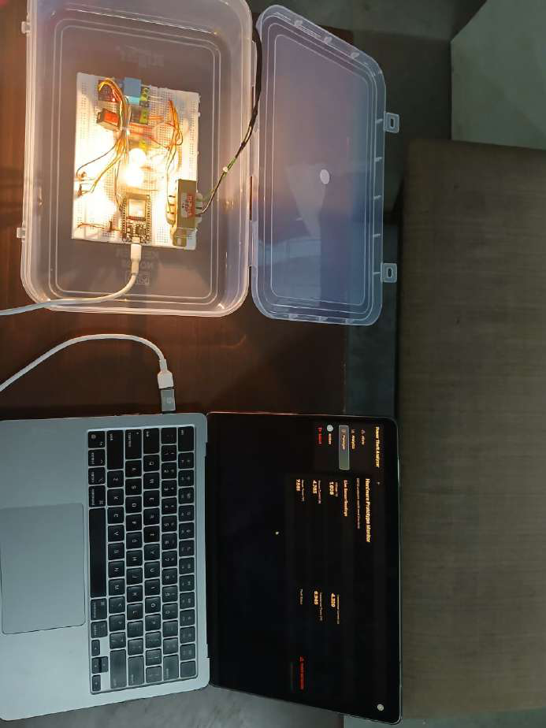

# Power Theft Analyzer

An ESP32-based power theft detection system with real-time electrical monitoring and web-based analytics.

## Overview

The Power Theft Analyzer is a low-cost prototype designed to detect possible power theft by comparing total current flowing through the supply with the current measured at the legal load.

The prototype simulates a **pre-meter tapping** scenario, where an additional load draws current without passing through the legal-load current sensor.

## System Architecture

The system uses an ESP32 microcontroller, voltage and current sensors, a step-down transformer, two loads, and a toggle switch to simulate and detect abnormal current flow.

## Hardware Prototype

The prototype uses:

- ESP32 Development Board
- 230 V to 12 V Step-Down Transformer
- Voltage Sensor Module
- 2 × ACS712 Current Sensors
- Rocker Switch
- Loads
- Breadboard
- Resistors
- Connecting wires

## How It Works

Two loads are connected to the system:

- **Legal load** — represents normal consumer consumption
- **Theft load** — represents an illegal pre-meter connection

When the theft switch is activated, the additional load draws current while bypassing the legal-load current sensor.

The ESP32 measures:

- Supply voltage
- Total current
- Legal-load current
- Power

The system compares the measured currents. When the difference exceeds the defined threshold, a possible theft condition is detected.

## Web Dashboard

The ESP32 sends the measured data over Wi-Fi to a companion web application.

### Prototype Monitoring

### Analytics

### Alerts

## System Demonstration

## Results

The prototype successfully demonstrated real-time detection of the simulated pre-meter theft condition.

When the theft load is switched on, the total current becomes higher than the legal-load current, allowing the ESP32 to detect the abnormal condition.

The website displays the measured electrical parameters and theft status in real time.

## Future Scope

- Improve the alerts system
- Add more detailed analytics
- Expand to multiple monitoring nodes
- Use cloud-based backend infrastructure
- Refine detection thresholds using utility data
- Extend the prototype to three-phase systems
- Develop a mobile application

## Project Report

The complete project report is available here:

[Project Report](Project%20Report.pdf)
